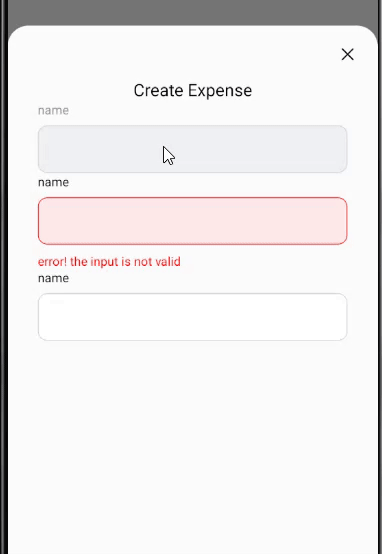
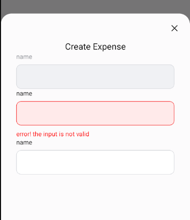

- A dynamic TextInput view that response to the keyboard's input and has 3 modes - Error, Disabled, Regular .

- It comes with a built-in TypeScript typings and is compatible with all popular JavaScript frameworks. You can use it directly or leverage well-maintained wrapper packages that allow for a more native integration with your frameworks of choice.

# Example:

> **Dataset Properties**

| Name               | Type                    | Default |
| ------------------ | ----------------------- | ------- |
| label              | string                  |
| isError            | boolean                 |
| message            | string                  |
| isDisabled         | boolean                 |
| isEditable         | boolean                 |
| textInputStyle     | ViewStyle               |
| lableStyle         | TextStyle               |
| errorViewStyle     | TextStyle               |
| errorTextStyle     | TextStyle               |
| lableDisabledStyle | TextStyle               |
| inputDisabledStyle | TextStyle               |
| placeHolderColor   | string                  |
| debounceDelay      | number                  |
| onDebounce         | (debouncedText) => void |
